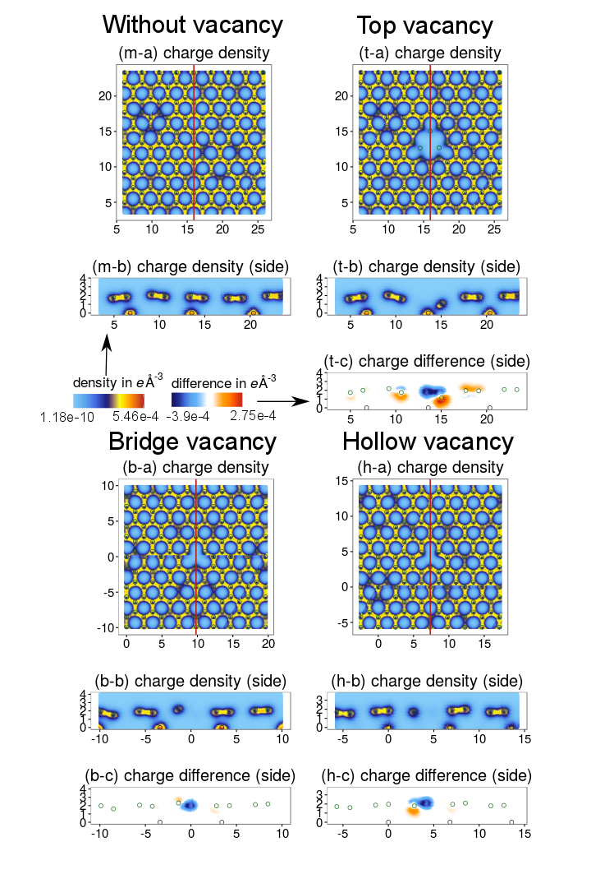

# About

For information about the basic usage refer to the package's vignette.

This package was the result of my endeavor to generate some neat plots of a variety of calculations using the DFT software VASP. Since it's charge density file are quite large it is essential to implement some functions for importing and modification in plain C++ and call them from a high level language (like R) to ensure responsiveness of the code. So since I already wrote those functions, why shouldn't I share it?

Okay, I wrote the code in the beginning of 2015 right when I started to learn R so some of it's components might be a little bit outdated or poorly written. But now it is finally time to release this code! 

And another note: I do neither work with VASP anymore nor do I have access to the program. I will try to help you in case of bugs, issues or questions but it will be more or less limited to the R issues.

### An example plot generated using this package:

